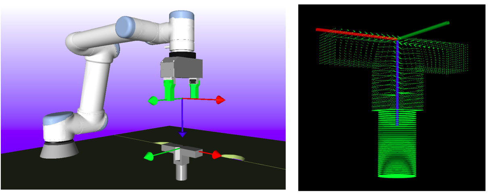
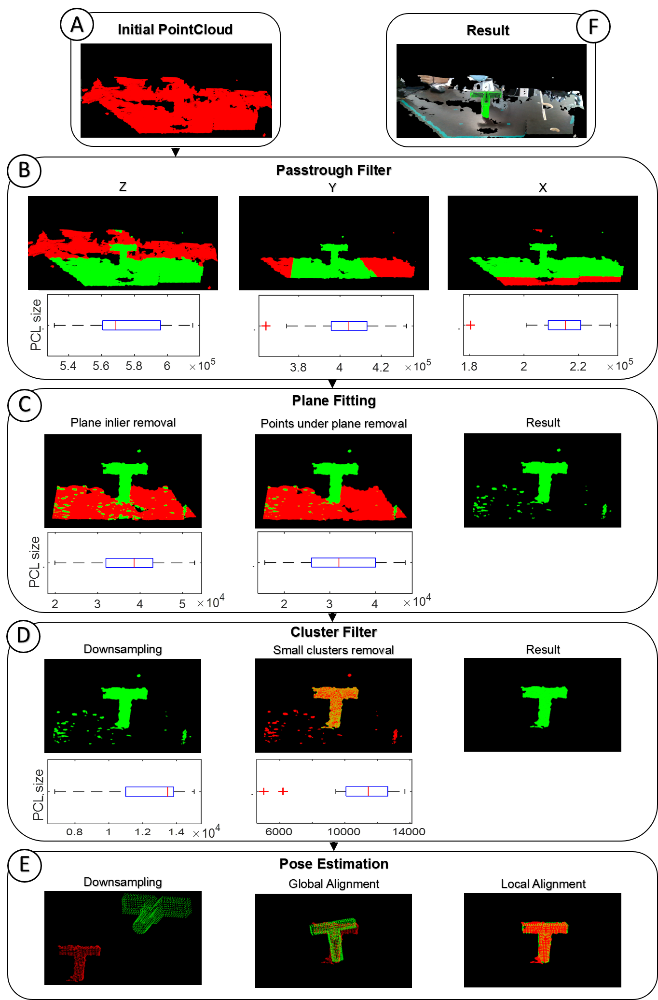

# ROVI 2: Pose estimation
This project is part of the semester project for the course of Robotics & Vision II of the Master in Advanced robotics at SDU ([Project report](https://drive.google.com/file/d/15sxckOLWULKDiB0q91TWExsH8m44Zkem/view?usp=sharing))([Video](https://www.youtube.com/watch?v=yFpsWwgW0GU)). It covers the pose estimation section in which the goal is to detect the object of interest in a scene point cloud in order for the UR arm to pick it. The scene point cloud is provided by a **Intel Realsense D435** stereo-camera. 

<h3 align="center">Object to be found in the scene</h3>
<p align="center">
    
  </a>
</p>


The pose estimation proces has multiple stages, (As shown in the picture below). For a reasoning about the different steps, please check the project report.
<h3 align="center">Workflow of the pose estimation process</h3>
<p align="center">
    
  </a>
</p>


# Installation
This project has been tested in Ubuntu 20.04.1 LTS and ROS Neotic. 
## Robwork installation
Since this program was integrated in a bigger project, there are some dependencies to the RobWork library. Mostly regarding operations with Transformation matrices. 
* [Robwork installation](https://www.robwork.dk/installation/)

## Realsense D435 Installation:
Additional steps for the camera installation.

* [Install librealsense packages](https://github.com/IntelRealSense/librealsense/blob/master/doc/distribution_linux.md)
	
* [Intel® RealSense™ SDK 2.0](https://github.com/IntelRealSense/librealsense/blob/master/doc/installation.md)

## ROS
We need ROS for the communication between the camera and the pose estimaton nodes.
* [Ros installation](https://wiki.ros.org/Installation/Ubuntu)

* [Interl Realsense Ros packages](https://github.com/IntelRealSense/realsense-ros)

* Install ROS package for RGB-D devices:
```bash
$ sudo apt-get install ros-noetic-rgbd-launch 
```

* Build catkin workspace in the repository folder:
```sh
$ cd /path/to/repository/folder
$ catkin_make 
```

# Usage
In order to run the pose estimation process, first we have to source the catkin workspace:
```bash
$ source devel/setup.bash 
```
The program offers two main options, we can get the point cloud from the camera via ROS or we can load a point cloud (**.pcd**) saved in disk.
```bash
$ rosrun vision pose_estimation -h
This program estimates the position of the piece in the scene.
Options:
	-h,--help 	Show this help message
	-s,--save 	 Save file eg: -c -s test.pcd
	-l,--load 	 Load file eg: -l Pointcloud_samples/test.pcd
	-c,--camera 	 enable ros node and real time camera 
```
If we want to use the ROS option, first we have to initialize the roscore.
```sh
$ roscore
```
Then we can launch the camera node that will publish the point cloud data.
```
$ roslaunch realsense2_camera rs_rgbd.launch 
```
The last step consists on starting the pose estimation node. This node will subscribe to the camera node in order to get the scene information. The scene will be visualized, showing a live update of the pointcloud. Once we have the scene ready, we can close the visualizer. This will save the last scene shown in it and the program will proceed with the pose estimation.
```sh
$ rosrun vision pose_estimation -c
```

We can test the load functionality with:

```sh
$ rosrun vision pose_estimation -l utilities/scene_sample.pcd
```

In case we want to estimate the pose of a different object, we need to go to **/src/vision/src*pose_estimation.cpp line 85** and change the object path with the path to the point cloud (**.pcd**) with the new object of interest.

```c++
85 utilities.load_object_of_interest(object, "./utilities/object.pcd");
```

After updating the code, we have to rebuild the catkin workspace.

## Result
The whole process should go as follows:


Video of the whole ROVI II project performing the pose estimation plus the forced based insertion:

[](http://www.youtube.com/watch?v=yFpsWwgW0GU "RoVi2 project SDU - Pose estimation and Force-based insertion")